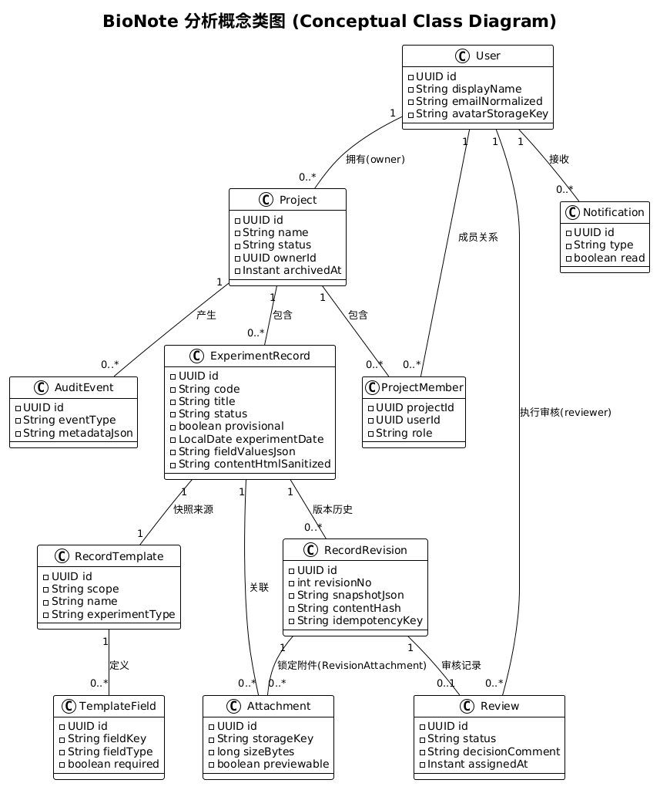
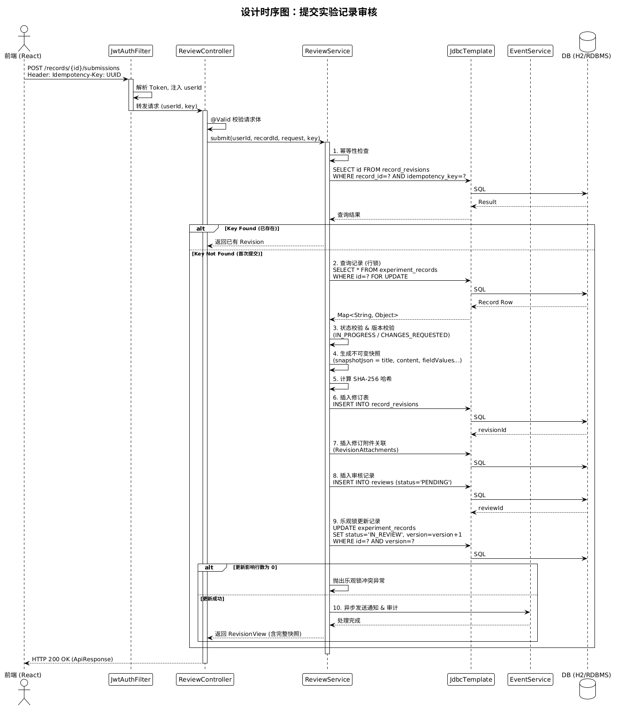
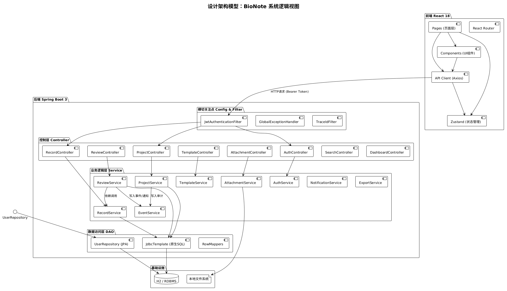

# BioNote 分析模型和设计模型汇总

本文档汇总 BioNote 实验数据记录与项目管理系统的分析模型与设计模型，包含分析概念类图、分析时序图、设计架构模型、设计类图及设计时序图，原始图文件位于仓库 `UML模型` 目录下，可直接预览与维护。

## 目录

- 第一部分：分析模型
  - 1.1 分析概念类图
  - 1.2 分析时序图：记录实验数据
- 第二部分：设计模型
  - 2.1 设计架构模型：系统逻辑视图
  - 2.2 设计类图：核心业务模块
  - 2.3 设计时序图：提交实验记录审核
- 附录：模型与用例对照

## 文档说明

本文档是《BioNote 用例模型汇总》的配套文档。用例模型定义了系统的功能需求和参与者交互，本文档在此基础上进一步给出分析模型和设计模型，分别从业务概念抽象和技术实现落地两个层次对用例进行细化。其中，分析模型关注"做什么"，设计模型关注"怎么做"，两者共同构成从需求到实现的完整建模链路。

---

## 第一部分：分析模型

分析模型从业务视角出发，描述系统的核心概念实体及其交互关系，不涉及具体技术实现细节。

### 1.1 分析概念类图

**图 1-1：分析概念类图**

本图展示 BioNote 系统的静态业务概念模型，涵盖 User、Project、ExperimentRecord、Template、Attachment 等核心实体及其关联关系。User 与 Project 之间为多对多参与关系（ProjectMember），Project 下可包含多条 ExperimentRecord，每条记录可关联多个 Attachment 和 Step。Template 为 Project 提供可复用的字段定义模板，指导实验记录的结构化填写。

### 1.2 分析时序图：记录实验数据

**图 1-2：分析时序图——记录实验数据**

本图围绕"记录实验数据"用例展开，展示实验记录者从新建实验记录到提交审核的完整业务交互流程。交互涉及 RecordPage、RecordEditor、DraftManager 和 RecordService 等分析层对象，体现用户在编辑器中填写数据、系统自动触发快照生成、保存草稿以及最终提交后状态变更为"待审核"的核心业务逻辑。

---

## 第二部分：设计模型

设计模型从技术实现视角出发，描述系统的分层架构、类的详细设计及关键交互流程，直接指导编码实现。

### 2.1 设计架构模型：系统逻辑视图

**图 2-1：设计架构模型——系统逻辑视图**

本图展示 BioNote 系统的前后端分层架构，前端采用 React 构建单页应用，后端基于 Spring Boot 提供 RESTful API。后端划分为 Controller 层（接收 HTTP 请求）、Service 层（业务逻辑编排）和 DAO 层（数据持久化），各层之间通过接口解耦。基础设施层包含 MySQL 数据库、文件存储服务和 IndexedDB 本地草稿存储，共同支撑系统的数据持久化与离线编辑能力。

### 2.2 设计类图：核心业务模块

**图 2-2：设计类图——核心业务模块**

本图聚焦核心业务模块的设计层面静态结构，详细展示 Controller、Service 及实体类的关键方法签名和依赖关系。ProjectController 和 RecordController 对外暴露 REST 接口，分别委托 ProjectService 和 RecordService 处理业务逻辑；实体类如 ExperimentRecord 和 Project 标注了 JPA 映射注解及关键字段，Service 层通过 Repository 接口访问数据库，体现分层解耦的设计原则。

### 2.3 设计时序图：提交实验记录审核

**图 2-3：设计时序图——提交实验记录审核**

本图展示"提交实验记录审核"的完整实现级调用流程。前端发起提交请求后，Controller 委托 Service 执行幂等性检查以防范重复提交，随后通过数据库行锁锁定目标记录以防并发冲突，Service 校验字段完整性后调用乐观锁机制更新记录状态，同时生成操作快照并写入事件日志，最终将审核任务推送至审核人队列，实现从提交到通知的端到端闭环。

---

## 附录：模型与用例对照

下表列出本文档中各模型图与《BioNote 用例模型汇总》中对应模块的简要对照关系。

| 模型图 | 对应用例模块 | 说明 |
|--------|-------------|------|
| 分析概念类图 | 全模块 | 覆盖用户、项目、实验记录、模板等全部业务实体 |
| 分析时序图：记录实验数据 | 实验记录编辑与富文本展示模块 | 对应"记录实验数据"用例的详细规约流程 |
| 设计架构模型：系统逻辑视图 | 全模块 | 系统的整体技术分层架构，支撑所有用例 |
| 设计类图：核心业务模块 | 项目管理模块、实验记录编辑模块 | 核心 Controller/Service/实体类的设计细化 |
| 设计时序图：提交实验记录审核 | 实验记录编辑与富文本展示模块 | 对应"提交审核"用例的完整实现级交互 |
