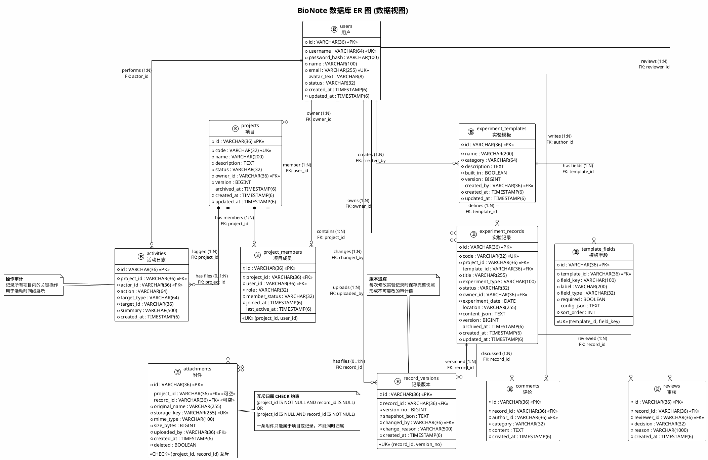

# 2. 数据视图 (Data View)

## 2.1 概述

BioNote 采用 **MySQL 8.4 关系型数据库** 作为永久性数据存储。数据库名为 `bionote`，由 Flyway 通过版本化 SQL 脚本 (V1__create_core_schema.sql) 管理 schema 变更。

数据模型围绕 **生物实验记录** 这一核心领域概念展开，涵盖用户、项目、模板、记录、文件、评论、审核、活动等实体。

---

## 2.2 核心实体说明

### 2.2.1 用户 (users)

系统用户账户。采用 BCrypt 散列存储密码，`status` 枚举为 ACTIVE / DISABLED。通过 `project_members` 与项目建立多对多关联，是系统中所有操作的执行主体。

| 字段 | 类型 | 约束 | 说明 |
|------|------|------|------|
| id | VARCHAR(36) | PK | UUID v4 |
| username | VARCHAR(64) | UNIQUE, NOT NULL | 登录用户名 |
| password_hash | VARCHAR(100) | NOT NULL | BCrypt 散列 |
| name | VARCHAR(100) | NOT NULL | 显示名称 |
| email | VARCHAR(255) | UNIQUE, NOT NULL | 邮箱 |
| avatar_text | VARCHAR(8) | NULLABLE | 头像缩写(如 "张") |
| status | VARCHAR(32) | NOT NULL | ACTIVE / DISABLED |
| created_at | TIMESTAMP(6) | NOT NULL | 创建时间 |
| updated_at | TIMESTAMP(6) | NOT NULL | 更新时间 |

### 2.2.2 项目 (projects)

研究项目/课题。拥有唯一 `code` 编码标识。由 `owner_id` 指向创建者，支持乐观锁 (`version`) 防并发冲突，可归档 (`archived_at`)。

| 字段 | 类型 | 约束 | 说明 |
|------|------|------|------|
| id | VARCHAR(36) | PK | UUID v4 |
| code | VARCHAR(32) | UNIQUE, NOT NULL | 项目编码 (如 BJ-23001) |
| name | VARCHAR(200) | NOT NULL | 项目名称 |
| description | TEXT | NOT NULL | 项目描述 |
| status | VARCHAR(32) | NOT NULL | active/paused/completed/reviewing/archived |
| owner_id | VARCHAR(36) | FK → users.id, NOT NULL | 项目负责人 |
| version | BIGINT | NOT NULL, DEFAULT 0 | 乐观锁版本号 |
| archived_at | TIMESTAMP(6) | NULLABLE | 归档时间 |

### 2.2.3 项目成员 (project_members)

用户与项目的多对多关联表，带有 `role`（owner/member/reviewer/observer）和 `member_status` 属性。

### 2.2.4 实验模板 (experiment_templates)

预定义的实验类型模板（如 Western Blot、PCR、细胞培养），包含结构化说明。`built_in` 区分系统内置模板与用户自定义模板。

### 2.2.5 模板字段 (template_fields)

模板的动态字段定义。`field_type` 支持 text/number/date/table/image/sample_picker/reagent_picker，`config_json` 存储字段级别的配置选项（如表格列定义、下拉选项等）。

### 2.2.6 实验记录 (experiment_records)

**核心实体**，代表一次具体的实验操作记录。`content_json` 以结构化 JSON 存储实验内容（章节、表格、反应式等），`version` 支持乐观锁。关联到项目和模板。

### 2.2.7 记录版本 (record_versions)

实验记录的版本快照。每次修改时，`snapshot_json` 保存完整内容快照，`change_reason` 记录修改原因，形成完整的审计追踪链。

### 2.2.8 附件 (attachments)

文件附件，采用 **互斥归属** 设计（CHECK 约束确保一条附件记录只能属于项目或记录之一）。支持软删除 (`deleted` 标志 + `@SQLRestriction`)。

| 字段 | 类型 | 约束 | 说明 |
|------|------|------|------|
| id | VARCHAR(36) | PK | UUID v4 |
| project_id | VARCHAR(36) | FK → projects.id, NULLABLE | 所属项目 (与 record_id 互斥) |
| record_id | VARCHAR(36) | FK → experiment_records.id, NULLABLE | 所属记录 (与 project_id 互斥) |
| original_name | VARCHAR(255) | NOT NULL | 原始文件名 |
| storage_key | VARCHAR(255) | UNIQUE, NOT NULL | 存储键 (UUID 文件名) |
| mime_type | VARCHAR(100) | NOT NULL | MIME 类型 |
| size_bytes | BIGINT | NOT NULL | 文件大小 (字节) |
| uploaded_by | VARCHAR(36) | FK → users.id, NOT NULL | 上传者 |
| created_at | TIMESTAMP(6) | NOT NULL | 上传时间 |
| deleted | BOOLEAN | NOT NULL, DEFAULT FALSE | 软删除标志 |

### 2.2.9 评论 (comments)

对实验记录的评论/批注，支持 `category` 分类（如 question/suggestion/correction）。

### 2.2.10 审核 (reviews)

对实验记录的正式审核决定，`decision` 为 approve/reject，`reason` 记录审核意见。

### 2.2.11 活动 (activities)

项目级别的操作审计日志。记录谁 (`actor_id`) 在哪个项目 (`project_id`) 对什么目标 (`target_type` + `target_id`) 执行了什么操作 (`action`)，形成完整的操作轨迹。

---

## 2.3 实体关系说明

```
users 1 ──── * project_members * ──── 1 projects
users 1 ──── * projects (owner)
users 1 ──── * experiment_records (owner)
users 1 ──── * attachments (uploader)
users 1 ──── * comments (author)
users 1 ──── * reviews (reviewer)
users 1 ──── * activities (actor)
users 1 ──── * experiment_templates (creator)

projects 1 ──── * experiment_records
projects 1 ──── * attachments
projects 1 ──── * activities

experiment_templates 1 ──── * template_fields
experiment_templates 1 ──── * experiment_records

experiment_records 1 ──── * record_versions
experiment_records 1 ──── * attachments
experiment_records 1 ──── * comments
experiment_records 1 ──── * reviews
```

关键约束：
- `attachments` 的 `project_id` 与 `record_id` **互斥**（CHECK 约束），一条附件只能归属项目或记录之一
- `project_members` 的 `(project_id, user_id)` 组合唯一，一个用户在一个项目中只有一种角色
- `record_versions` 的 `(record_id, version_no)` 组合唯一，每个版本号在记录内不重复

---

## 2.4 索引策略

| 索引 | 表 | 列 | 用途 |
|------|-----|-----|------|
| PRIMARY KEY (所有表) | 全部 | id (UUID) | 主键索引，聚簇索引 |
| uk_users_username | users | username | 登录查询 |
| uk_users_email | users | email | 邮箱唯一性校验 |
| uk_projects_code | projects | code | 项目编码查找 |
| uk_project_members_project_user | project_members | (project_id, user_id) | 成员唯一性 |
| uk_template_fields_key | template_fields | (template_id, field_key) | 字段唯一性 |
| uk_experiment_records_code | experiment_records | code | 记录编码查找 |
| uk_record_versions_number | record_versions | (record_id, version_no) | 版本号唯一性 |
| uk_attachments_storage_key | attachments | storage_key | 文件定位 |
| idx_records_project_status_updated | experiment_records | (project_id, status, updated_at) | 项目记录列表排序查询 |
| idx_activities_project_created | activities | (project_id, created_at) | 项目活动时间线 |

---

## 2.5 数据库 ER 图 (PlantUML)



---

## 2.6 数据量估算与存储策略

| 实体 | 预估量级 | 存储策略 |
|------|---------|---------|
| users | 10² | 标准行存储 |
| projects | 10² ~ 10³ | 标准行存储 |
| project_members | 10³ | 复合唯一索引 |
| experiment_templates | 10¹ ~ 10² (内置) + 用户自定义 | 标准行存储 |
| template_fields | 10² 每模板 | 按 sort_order 排序 |
| experiment_records | 10³ ~ 10⁴ | 复合索引 (project_id, status, updated_at) |
| record_versions | 10⁴ ~ 10⁵ (记录数 × 平均版本数) | 按 record_id 聚簇查询 |
| attachments | 10³ ~ 10⁴ | 文件本体存本地文件系统，DB 仅存元数据 |
| comments | 10³ ~ 10⁴ | 按 record_id 查询 |
| reviews | 10³ | 按 record_id 查询 |
| activities | 10⁴ ~ 10⁵ | 按 (project_id, created_at) 复合索引查询 |

**文件存储策略：**
- 文件实际内容存储在 `./storage/` 目录下，以 `storage_key`（UUID 字符串）命名
- 数据库 `attachments` 表只存储元数据（原始文件名、MIME 类型、大小、归属关系）
- 支持软删除（`deleted = true`），不立即物理删除文件
- 白名单控制允许上传的扩展名：`jpg, png, pdf, csv, xls, xlsx`

**JSON 字段策略：**
- `experiment_records.content_json`：存储实验内容的结构化 JSON（章节、数据表、反应式等），充分利用 MySQL 8.4 的 JSON 函数进行查询
- `template_fields.config_json`：存储字段级配置（表格列定义、下拉选项），灵活扩展
- `record_versions.snapshot_json`：完整内容快照，实现版本回滚
