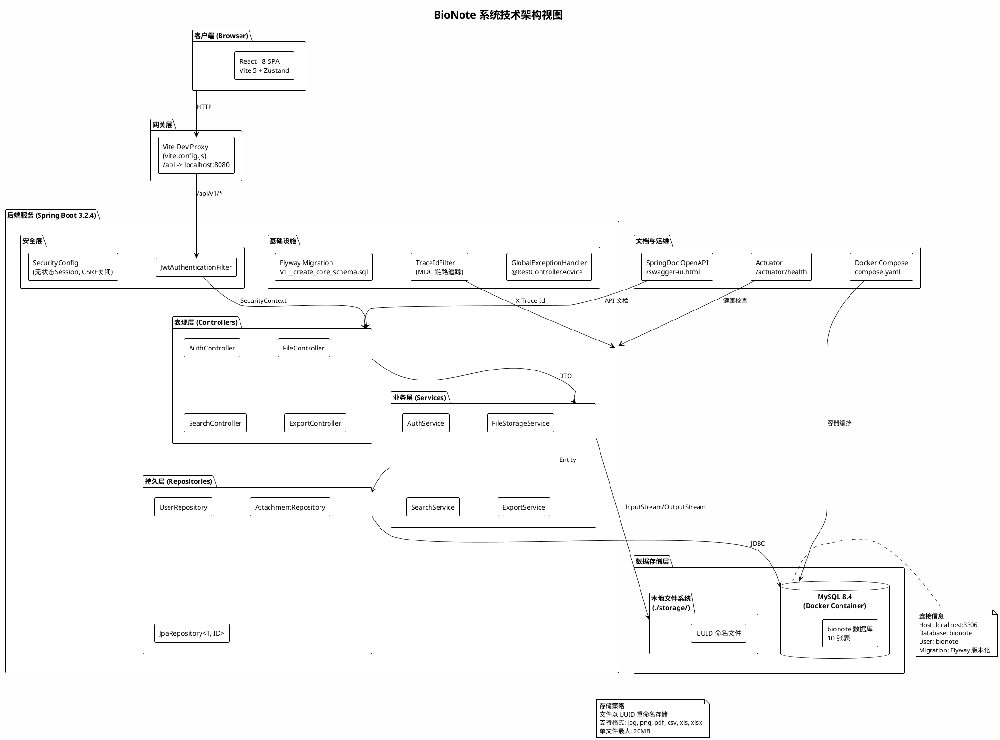

# 1. 技术视图 (Technology View)

## 1.1 概述

BioNote 是一个**生物实验记录助手**系统，采用前后端分离的 B/S 架构。技术栈选型遵循"成熟稳定、生态丰富、学习成本低"的原则，兼顾课程大作业的可演示性和工程实践的真实性。

---

## 1.2 技术栈总览

| 层次 | 技术选型 | 版本 | 选型理由 |
|------|---------|------|---------|
| **后端语言** | Java | 21 (LTS) | 长期支持版本，虚拟线程、Record 类等现代特性 |
| **后端框架** | Spring Boot | 3.2.4 | 企业级 Java 生态标准，自动配置、起步依赖、Actuator 运维端点 |
| **安全框架** | Spring Security + JJWT | 6.x + 0.12.6 | 声明式安全模型，无状态 JWT 认证 |
| **ORM** | Spring Data JPA / Hibernate | 6.x (内嵌) | 声明式 Repository，自动审计，UUID 主键生成 |
| **数据库** | MySQL | 8.4 | 成熟的关系型数据库，事务支持，Flyway 迁移管理 |
| **数据库迁移** | Flyway | (Spring Boot 托管) | 版本化 SQL 迁移，确保 schema 可追溯 |
| **API 文档** | SpringDoc OpenAPI | 2.3.0 | Swagger UI，零注解侵入式 API 浏览 |
| **PDF 生成** | OpenPDF (LibrePDF) | 1.3.43 | 轻量级，纯 Java，无外部依赖 |
| **Excel 生成** | Apache POI (OOXML) | 5.2.5 | Java 操作 Office 文档的事实标准 |
| **前端语言** | JavaScript (ES2022+) | — | 与课程教学一致，降低学习曲线 |
| **前端框架** | React | 18.3.1 | 组件化 UI，生态成熟，社区活跃 |
| **构建工具 (前端)** | Vite | 5.4.6 | 极速 HMR，原生 ESM，开箱即用 |
| **路由** | React Router DOM | 6.26.2 | 嵌套路由，loader/action 数据流 |
| **状态管理** | Zustand | 4.5.5 | 轻量（<1KB），无 boilerplate，基于 Hook |
| **HTTP 客户端** | Axios | 1.18.1 | 拦截器、取消请求、进度事件 |
| **E2E 测试** | Playwright | 1.61.1 | 多浏览器，自动等待，trace 录制 |
| **后端测试** | JUnit 5 + MockMvc | (Spring Boot 内嵌) | 集成测试，真实 Spring 上下文 |
| **容器化** | Docker Compose | — | MySQL 服务一键启动，环境一致性 |
| **构建工具 (后端)** | Maven | (Wrapper) | 依赖管理，插件生态，Spring Boot 原生支持 |
| **版本控制** | Git | — | 分支策略：main + feature 分支 (p1-p5) |

---

## 1.3 架构分层

系统在逻辑上划分为 **5 层架构**，各层职责清晰、单向依赖：

```
┌─────────────────────────────────────────────────────┐
│                   前端 (React SPA)                    │
│   Pages → Components → API Layer (Axios)            │
│   State: Zustand (authStore / appStore)              │
├─────────────────────────────────────────────────────┤
│                  HTTP / REST API                     │
│   JSON (ApiResponse<T> 统一封装)                      │
│   认证: Bearer JWT Token (Authorization Header)       │
├─────────────────────────────────────────────────────┤
│              后端 - 表现层 (Controller)               │
│   @RestController + @RequestMapping                  │
│   输入校验 (@Valid), 全局异常处理 (@RestControllerAdvice) │
├─────────────────────────────────────────────────────┤
│              后端 - 业务层 (Service)                   │
│   @Service + @Transactional                          │
│   业务逻辑编排, DTO 转换, 权限校验                      │
├─────────────────────────────────────────────────────┤
│              后端 - 持久层 (Repository)                │
│   Spring Data JPA Repository                         │
│   实体映射 (@Entity), 审计 (@EntityListeners)          │
├─────────────────────────────────────────────────────┤
│              基础设施层                                │
│   MySQL 8.4 (Docker)  |  本地文件系统 (storage/)       │
│   Flyway 迁移  |  JWT 无状态认证  |  TraceId 链路追踪   │
└─────────────────────────────────────────────────────┘
```

---

## 1.4 技术选型详解

### 1.4.1 后端：Spring Boot 3.2.4 + Java 21

**选型理由：**
- Java 21 LTS 引入虚拟线程（Virtual Threads），未来可无缝升级以提升 I/O 密集型场景吞吐量
- Spring Boot 3.2.x 全面支持 Jakarta EE 9+（`jakarta.*` 命名空间），与 Java 21 Record 类天然配合（如 `@ConfigurationProperties` 可直接绑定到 Record）
- `spring-boot-starter-*` 起步依赖体系大幅减少手动配置

### 1.4.2 安全：Spring Security + JJWT 无状态 JWT

**选型理由：**
- 前后端分离架构天然适合无状态 Token 认证，避免 Session 共享问题
- JJWT 0.12.x 是纯 Java JWT 库，API 流畅，支持 HMAC-SHA 系列签名算法
- Spring Security 过滤器链（`JwtAuthenticationFilter`）在请求进入 Controller 前完成身份提取和权限校验
- `BCryptPasswordEncoder` 存储密码散列，安全可靠

### 1.4.3 持久层：Spring Data JPA + Flyway + MySQL 8.4

**选型理由：**
- Spring Data JPA 提供声明式 Repository 接口（`JpaRepository<T, ID>`），免去模板代码
- `@MappedSuperclass BaseEntity` 统一管理 UUID 主键和审计字段（`createdAt`/`updatedAt`）
- Flyway 版本化迁移：SQL 脚本命名 `V{n}__description.sql`，保证数据库变更可追溯、可复现
- MySQL 8.4 作为 MySQL 8.0 的创新版本，拥有更好的查询优化器和 JSON 支持
- 测试环境使用 H2 内存数据库（MySQL 兼容模式），零配置、高速

### 1.4.4 前端：React 18 + Vite 5 + Zustand

**选型理由：**
- React 18 并发特性（`createRoot`、自动批处理）提升渲染性能
- Vite 5 基于原生 ESM 的开发服务器，HMR 速度不受项目规模影响
- Zustand 作为全局状态管理：API 极简（`create((set) => ({...}))`），无需 Provider 包裹，天然支持 Selector 避免不必要渲染
- 特**未选 TypeScript** 的考量：课程教学以 JavaScript 为主，JSDoc 注释（`@typedef`）提供类型提示的同时降低语法负担

### 1.4.5 报告生成：OpenPDF + Apache POI

**选型理由：**
- OpenPDF 是 iText 的开源分支，LGPL 协议友好，支持中文（需嵌入字体）
- Apache POI OOXML 支持 `.xlsx` 格式（比 `.xls` 更现代，行列限制宽松）
- 两者均为纯 Java 实现，无需安装 LibreOffice/Office 等外部依赖

### 1.4.6 DevOps：Docker Compose + Playwright + 健康检查

**选型理由：**
- Docker Compose 单文件定义 MySQL 服务，`docker compose up -d` 一键启动
- Spring Boot Actuator 暴露 `/actuator/health` 端点，可被 Docker healthcheck 或 K8s 探针消费
- Playwright 用于 E2E 测试，支持 Chromium 浏览器，trace 录制便于排查

---

## 1.5 部署架构图 (PlantUML)



---

## 1.6 关键技术决策

| 决策点 | 选择 | 备选方案 | 决策依据 |
|--------|------|---------|---------|
| 后端语言 | Java 21 | Python (FastAPI)、Go | 课程教学语言一致；Spring 生态成熟 |
| 前端语言 | JavaScript | TypeScript | 降低学习曲线，JSDoc 可补充类型提示 |
| 数据库 | MySQL 8.4 | PostgreSQL、MongoDB | 课程教材以 MySQL 为主；关系模型适合业务 |
| ORM | JPA/Hibernate | MyBatis、JDBC Template | 自动审计、声明式查询，减少模板代码 |
| 状态管理 | Zustand | Redux Toolkit、Jotai | API 简洁度最高，适合中小型 SPA |
| 文件存储 | 本地文件系统 | MinIO (S3)、云存储 | 大作业场景足够，零运维成本 |
| API 风格 | RESTful | GraphQL、gRPC | 课程教学重点，前端生态兼容性最好 |
| 认证方案 | JWT (无状态) | Session + Cookie | 前后端分离标准做法，无服务端状态 |
