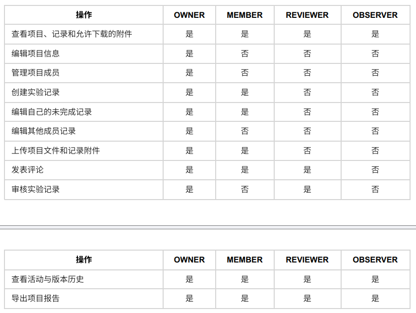
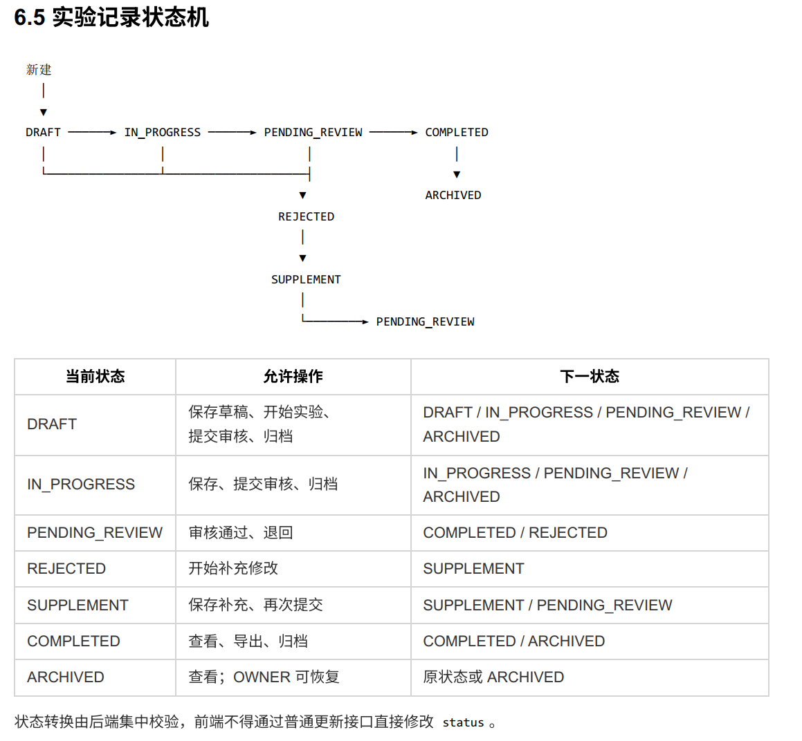

SYS_ADMIN:
    创建实验室，指定实验室负责人

实验室角色：
    LAB_ADMIN:实验室负责人
        管理邀请码、成员与角色，创建项目
    MENTOR:导师
        可以审核加入申请，查看邀请码，创建项目
    MEMBER：普通实验室成员
        仅能被邀请进入项目

一位用户只能加入一个实验室

实验室管理流程：

系统管理员创建实验室
        ↓
指定负责人，负责人获得 LAB_ADMIN
        ↓
LAB_ADMIN 生成邀请码
        ↓
用户注册时填写邀请码，或注册后提交加入申请
        ↓
申请状态变为 PENDING
        ↓
LAB_ADMIN / MENTOR  审核
        ↓
APPROVED：创建 MEMBER 成员关系
REJECTED：保留申请历史，不创建成员关系
        ↓
LAB_ADMIN 后续调整成员实验室角色

注册/登陆流程：
    新用户注册：填写用户名、邮箱、密码、实验室邀请码（可选）
    ↓
    若未填写实验室邀请码，则该用户初始不属于任何实验室。后续经过申请且被审核通过后加入实验室
    ↓
    用户使用邮箱/用户名+密码登录

项目角色：
    
    //补充：邀请新成员，只能由OWNER邀请

项目管理流程：
    LAB_ADMIN/MENTOR 作为项目OWNER创建新项目，完善项目名称、项目目的
    ↓
    OWNER邀请新成员，设置项目中role分配

实验记录流程：
    选定某一项目，在特定项目下新建一条实验记录
    ↓
    
    （实验记录支持附件上传）

搜索功能